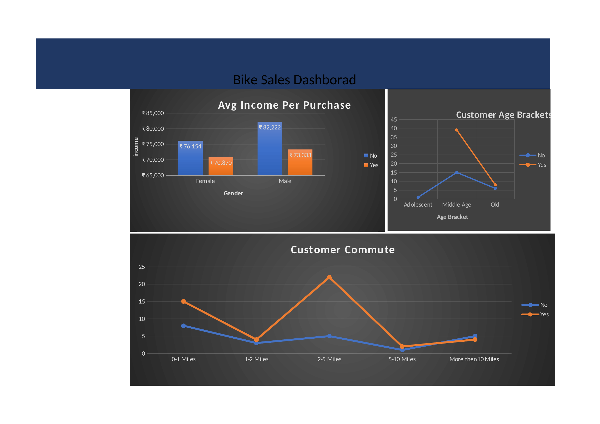

# Excel-Project-bike_buyers
# 🚲 Bike Sales Dashboard – Excel Data Analysis Project

An interactive Excel dashboard analyzing customer demographics and purchasing behavior for a bike retailer, built using **PivotTables**, **PivotCharts**, and **Slicers**.

## 📊 Project Overview

This project analyzes a dataset of **1,026 customers** to uncover patterns in who buys bikes and why — helping the business understand its customer base and target future marketing more effectively.

**Dataset fields:** Marital Status, Gender, Income, Children, Education, Occupation, Home Owner status, Number of Cars, Commute Distance, Region, Age, and whether the customer Purchased a Bike.

## 🎯 Key Questions Explored

- Does **income** influence bike purchases, and does this differ by gender?
- Which **age bracket** (Adolescent, Middle Age, Old) is most likely to purchase a bike?
- How does **commute distance** relate to bike purchase decisions?

## 🔍 Key Insights

- **Income & Gender:** Customers who did *not* purchase a bike had a higher average income than those who did, across both genders — suggesting bike buyers in this dataset skew toward more budget-conscious customers rather than higher earners.
- **Age Bracket:** The **Middle Age** group shows by far the highest bike purchase activity compared to Adolescent and Old age brackets.
- **Commute Distance:** Purchase interest (Yes) spikes sharply for customers commuting **2–5 miles**, while it's lowest for very short (1–2 mile) and longer (5–10 mile) commutes — a sweet spot worth targeting in marketing.

## 🛠️ Tools & Techniques Used

- Excel **PivotTables** for aggregating and summarizing customer data
- **PivotCharts** for visualizing trends (bar chart, line charts)
- **Slicers** for interactive filtering
- Data cleaning and structuring on a dedicated working sheet

## 📁 Repository Structure

```
├── Bike_Sales_Dashboard.xlsx   # Full workbook: raw data, working sheet, pivot tables, dashboard
├── dashboard_screenshot.png    # Preview of the final dashboard
└── README.md
```

## 📸 Dashboard Preview



## 🚀 How to Use

1. Download `Bike_Sales_Dashboard.xlsx`
2. Open in Excel (2010 or later, for Slicer support)
3. Navigate to the **DAShborad** sheet to explore the interactive charts and slicers
4. Check the **PIvot Table** sheet to see the underlying pivot tables driving each chart


Feel free to connect if you have questions about the analysis or approach!
